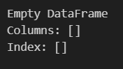
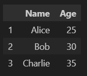
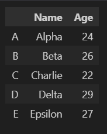
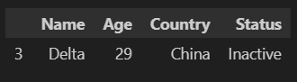
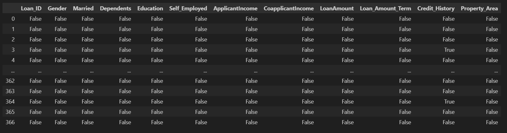

# Aim
To perform basic dataframe commands involving the pandas module

# Algorithm
Import the pandas library

Create or load a dataset into a DataFrame

Look at the structure of the data using head(), info(), and describe()

Pick rows and columns using loc[] and iloc[]

Filter the data using conditions

Add, change, or delete columns or rows

Handle missing values using isnull(), fillna(), or dropna()

Join, merge, or combine different DataFrames

Group data and calculate summaries using groupby()

Sort the data with sort_values() or sort_index()

Export (save) the data to CSV, Excel, or other file formats


# Coding and Output

```python
import pandas as pd
import numpy as np
import seaborn as sns
from scipy.stats import zscore
```
### Pandas Series

```python
# series from a list
data = [10, 20, 30, 40]
series_from_list = pd.Series(data)
print(series_from_list)
```
  

```python
# series with specified index
series_with_index = pd.Series(data, index=['a', 'b', 'c', 'd'])
print(series_with_index)
```
  

```python
# series from a dict
data_dict = {'a': 10, 'b': 20, 'c': 30}
series_from_dict = pd.Series(data_dict)
print(series_from_dict)
```
  

```python
# series from a scaler value and index
scalar_series = pd.Series(5, index=[0, 1, 2, 3])
print(scalar_series)
```
  

### Pandas DataFrame

```python
# empty data frame
df_empty = pd.DataFrame()
print(df_empty)
```
  

```python
# data frame using list
data_list = [10, 20, 30, 40]
df_list = pd.DataFrame(data_list, columns=['Numbers'])
df_list
```
  

```python
# data frame using dict
data_dict = {
    'Name': ['Alice', 'Bob', 'Charlie'],
    'Age': [25, 30, 35]
}
df_dict = pd.DataFrame(data_dict, index=[1,2,3])
df_dict
```
  

```python
# data frame using a list of dicts
data_list_of_dicts = [
    {'Name': 'Alice', 'Age': 25},
    {'Name': 'Bob', 'Age': 30},
    {'Name': 'Charlie', 'Age': 35}
]
df_list_dict = pd.DataFrame(data_list_of_dicts)
df_list_dict
```
  

```python
# data frame using a nested list
data_nested_list=[
    ["Alpha", "Gaurd", "A"],
    ["Beta", "Attack", "B"],
    ["Charlie", "Retrieve", "C"]
]
df_nested_list = pd.DataFrame(data_nested_list, columns=["Place", "Duty", "Notation"], index=[1,2,3])
df_nested_list
```
  

### Row and Column operation on DataFrame

```python
# creating a data frame
data = {
    "Name" : ["Alpha", "Beta", "Charlie", "Delta", "Epsilon", "Fermi"],
    "Place" : ["India", "USA", "Russia", "China", "Japan", "Africa"],
    "Age" : [24, 26, 22, 29, 27, 21],
    "SubPlace" : ["Delhi", "NewYork", "Moscow", "Beijing", "Tokyo", "Cape Town"]
}
df = pd.DataFrame(data, index=['A','B','C','D','E','F'])
df
```
  

```python
# drop a column
df.drop("SubPlace", axis=1, inplace=True)
df
```
  

```python
# rename a column
df.rename(columns={"Place" : "Country"}, inplace=True)
df
```
  

```python
# insert a column
df.insert(3, "Status", ["Active"]*6)
df
```
  

```python
# drop a row
df.drop('F', axis=0, inplace=True)
df
```
  

```python
# insert a row using loc
df.loc['G'] = ["Gamma", "Ukraine", 60, "Rogue"]
df
```
  

```python
# insert a row using concat
new_row = pd.DataFrame([["Iota", "Iraq", 43, "Missing"]], columns=df.columns, index=['I'])
df = pd.concat([df, new_row])
df
```
  

```python
# pop a column
status = pd.DataFrame(df.pop("Status"))
status
```
  

### Indexing and Selecting Data

```python
data = {
    "Name": ["Alpha", "Beta", "Charlie", "Delta", "Epsilon"],
    "Age": [24, 26, 22, 29, 27],
    "Country": ["India", "USA", "Russia", "China", "Japan"],
    "Status": ["Active", "Inactive", "Active", "Inactive", "Active"]
}
df = pd.DataFrame(data, index=['A','B','C','D','E'])
df
```
  

```python
# selecting using a column name
df['Name']
```
  

```python
# slecting multiple columns using list
df[["Name", "Age"]]
```
  

```python
# filter method --> parameters: ["items", "like", "regex", "axis"]
item_filter = df.filter(items=["Name", "Age"])
item_filter
```
  

```python
like_filter = df.filter(like='A', axis=0)
like_filter
```
  

```python
regex_filter = df.filter(regex=".*e$", axis=1)
regex_filter
```
  

```python
# using loc --> Label Based Indexing
# by row label
row = df.loc["B"]
print(row)
```
  

```python
# by row and column label
row = df.loc["B", "Name"]
print(row)
```
  

```python
# multiple rows and columns
output = df.loc[["B", "D"], ["Name", "Age"]]
print(output)
```
  

```python
# select all rows
output = df.loc[:, :]
print(output)
```
  

```python
# using iloc --> Integer location based indexing
#using row index
row = df.iloc[1]
print(row)
```
  

```python
# using both row and column index
output = df.iloc[0:2, 0:2]
print(output)
```
  

```python
df.iat[1,2]
```
  

```python
df.at['A','Name']
```
  

### Subset Observations on Rows

```python
data = {
    "Name": ["Alpha", "Beta", "Beta", "Delta", "Epsilon"],
    "Age": [24, 22, 22, 29, 27],
    "Country": ["India", "USA", "USA", "China", "Japan"],
    "Status": ["Active", "Inactive", "Inactive", "Inactive", "Active"]
}
df = pd.DataFrame(data)
filtered_df = df[df["Name"].str.len() > 4]
filtered_df
```
  

```python
filtered_df= df.drop_duplicates()
filtered_df
```
  

```python
df.sample(frac=0.5)
```
  

```python
df.sample(n=1)
```
  

```python
df.nlargest(1, "Age")
```
  

```python
df.nsmallest(1,"Age")
```
  

```python
df.head(1)
```
  

```python
df.tail(1)
```
  

### DataFrame Sorting

```python
# creating a data frame
data = {
    "Name": ["Alpha", "Beta", "Charlie", "Delta", "Epsilon"],
    "Age": [24, 26, 22, 29, 27],
    "Country": ["India", "USA", "Russia", "China", "Japan"],
    "Status": ["Active", "Inactive", "Active", "Inactive", "Active"]
}
df = pd.DataFrame(data, index=['A','B','C','D','E'])
```

```python
# sorting values by age in ascending order
df.sort_values(by="Age", ascending=False)
```
  

```python
# sort values by age in descending order
df.sort_values(by="Age", ascending=False)
```
  

```python
# sorting values by multiple features
df.sort_values(by=["Age", "Status"])
```
  

```python
# sort by row labels
df.sort_index()
```
  

```python
# sort by column labels
df.sort_index(axis=1)
```
  

### GroupBy

```python
# creating a data frame
data = {
    "Name": ["Alpha", "Beta", "Charlie", "Delta", "Epsilon"],
    "Age": [24, 26, 22, 29, 27],
    "Country": ["India", "USA", "Russia", "China", "Japan"],
    "Status": ["Active", "Inactive", "Active", "Inactive", "Active"]
}
df = pd.DataFrame(data, index=['A','B','C','D','E'])
```

```python
# groupby a single column
groupped_status = df.groupby("Status")
groupped_status
```
  

```python
# groupby multiple columns
group1 = df.groupby(["Country", "Status"])
group1
```
  

```python
# view groups
groupped_status.groups
```
  

```python
# get count per groups
groupped_status.count()
```
  

```python
# get sum per group
groupped_status.sum()
```
  

```python
data = {
    "Department": ["HR", "IT", "HR", "Finance", "IT", "Finance", "HR"],
    "Employee": ["Alice", "Bob", "Carol", "David", "Eve", "Frank", "Grace"],
    "Salary": [50000, 60000, 52000, 70000, 65000, 72000, 51000],
    "Experience": [2, 3, 1, 5, 4, 6, 2]
}
df = pd.DataFrame(data)
```

```python
# group the values based on department
grouped = df.groupby("Department")
```

```python
# perform mean
grouped.mean(numeric_only=True)
```
  

```python
# perform sum
grouped[["Salary", "Experience"]].sum()
```
  

```python
# get count for all features
grouped.count()
```
  

```python
# find max in a group
grouped[["Salary", "Experience"]].max()
```
  

```python
# find min in a group
grouped[["Salary", "Experience"]].min()
```
  

### Data Cleaning and Outlier Detection

```python
# creating data frame from csv file
df = pd.read_csv("Loan_data.csv")
df
```
  

```python
# display info
df.info()
```
  

```python
df.shape
```
  

```python
df.describe()
```
  

```python
# checking for null values
df.isnull()
```
  

```python
# counting null values in each feature
df.isna().sum()
```
  

```python
# dropping the null values
dropped_df = df.dropna()
dropped_df
```
  

```python
# filling the null values with 0
filled_df = df.fillna(0)
filled_df
```
  

```python
# filling null values using ffill method
ffilled_df = df.ffill()
ffilled_df
```
  

```python
# filling null values using bfill method
bfilled_df = df.bfill()
bfilled_df
```
  

```python
# filling null values with mean
new_df = df
new_df["LoanAmount"] = df["LoanAmount"].fillna(df["LoanAmount"].mean())
new_df["Loan_Amount_Term"] = df["Loan_Amount_Term"].fillna(df["Loan_Amount_Term"].mean())
new_df.isna().sum()
```
  

```python
# creating a new data frame for outlier detection
age=[1,3,28,27,25,92,30,39,40,50,26,24,29,94]
af=pd.DataFrame(age)
af
```
  

```python
# using boxplot to detect outliers
sns.boxplot(data=af)
```
  

```python
# use iqr to remove outliers
Q1 = np.percentile(age, 25)
Q3 = np.percentile(age, 75)
IQR = Q3 - Q1
lower_bound = Q1 - 1.5 * IQR
upper_bound = Q3 + 1.5 * IQR

print(f"Quartile-1 : {Q1}")
print(f"Quartile-3 : {Q3}")
print(f"IQR : {IQR}")
print(f"Lower Bound : {lower_bound}")
print(f"Upper Bound : {upper_bound}")
```
  

```python
# remove outliers
af = af[(af >= lower_bound) & (af <= upper_bound)]
```

```python
# perform boxplot to verify outlier removal
sns.boxplot(data=af)
```
  

```python
# creating data frame to perform z-score
data=[1,12,15,18,21,24,27,30,33,36,39,42,45,48,51,54,57,60,63,66,69,72,75,78,81,84,87,90,93,96,99,158]
df=pd.DataFrame(data)
```

```python
# perform boxplot to detect outliers
sns.boxplot(data=df)
```
  

```python
# perform z-score method to detect outliers
z_score = np.abs(zscore(df))
threshold = 3
```

```python
# remove outliers
outliers = df[z_score>3]
print(outliers)
cleaned_df = df[z_score<3]
print(cleaned_df)
```
  

```python
# perform boxplot to verify outlier removal
sns.boxplot(data=cleaned_df)
```
  
